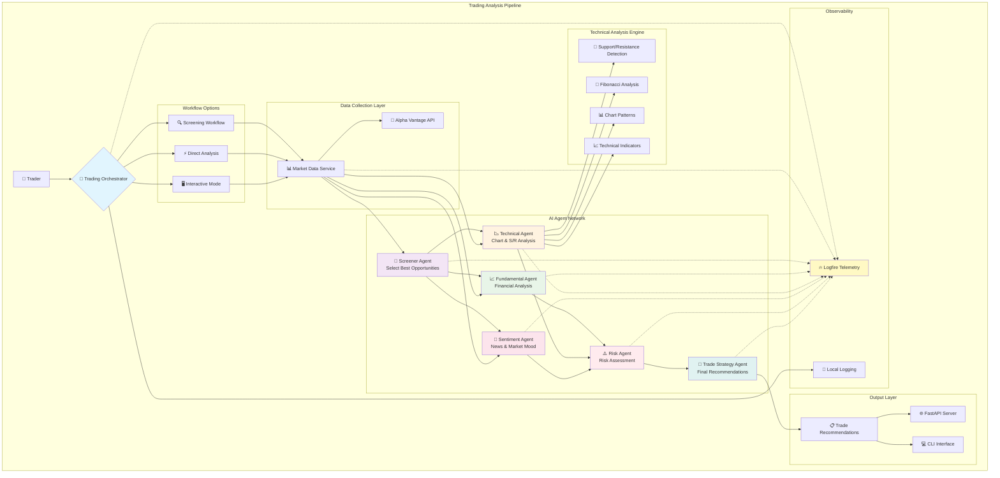

# Nix Trader AI

A production-ready multi-agent trading application framework using pydantic-ai with comprehensive telemetry. This application helps professional traders select financial instruments with high-potential opportunities through AI-powered multi-dimensional analysis.

## 🏗️ Multi-Agent Architecture



## ✨ Key Features

### 🤖 Intelligent Agent Network
- **🎯 Screener Agent**: Identifies top opportunities from favorite instruments
- **📈 Fundamental Agent**: Deep financial statement and ratio analysis
- **📉 Technical Agent**: Advanced chart analysis with S/R level detection
- **📰 Sentiment Agent**: News sentiment and market mood analysis
- **⚠️ Risk Agent**: Comprehensive risk assessment and position sizing
- **🎲 Trade Strategy Agent**: Synthesizes all inputs into actionable recommendations

### 🔍 Advanced Technical Analysis
- **Support & Resistance Detection**: Automated pivot point analysis with strength scoring
- **Fibonacci Retracements**: Multi-timeframe level calculations
- **Chart Pattern Recognition**: Trend identification and pattern strength analysis
- **Technical Indicators**: RSI, MACD, Moving Averages integration

### 🔄 Flexible Workflows
- **Screening Workflow**: Screen → Select → Analyze (recommended)
- **Direct Analysis**: Analyze specific instruments immediately
- **Interactive Mode**: Menu-driven interface with trader selection

### 📊 Comprehensive Telemetry
- **Logfire Integration**: Production-ready observability platform
- **Performance Monitoring**: Agent execution times and success rates
- **Business Metrics**: Analysis quality and recommendation tracking
- **Error Tracking**: Detailed error context and debugging information

## 🚀 Quick Start

### Installation

1. **Clone the repository:**
```bash
git clone <repository-url>
cd nix-trader-ai
```

2. **Set up Python environment:**
```bash
python -m venv venv
source venv/bin/activate  # On Windows: venv\Scripts\activate
pip install -e .
```

3. **Configure environment variables:**
```bash
cp .env.example .env
# Edit .env with your API keys
```

### Required Environment Variables

```bash
# Essential API Keys
OPENAI_API_KEY=your_openai_api_key_here
ALPHA_VANTAGE_API_KEY=your_alpha_vantage_api_key_here

# Trading Configuration
MIN_RISK_REWARD_RATIO=2.0
MAX_POSITION_SIZE_PERCENT=5.0
DEFAULT_STOP_LOSS_PERCENT=2.0

# Telemetry (Optional)
LOGFIRE_TOKEN=your_logfire_token  # For production monitoring
ENABLE_TELEMETRY=true

# Application Settings
LOG_LEVEL=INFO
ENVIRONMENT=development
```

## 💻 Usage

### Command Line Interface

**Full AI Analysis (Recommended):**
```bash
PYTHONPATH=src python -m nix_trader_ai.main
```

**Interactive Mode:**
```bash
PYTHONPATH=src python -m nix_trader_ai.main --interactive
```

**Skip Screening (Direct Analysis):**
```bash
PYTHONPATH=src python -m nix_trader_ai.main --skip-screening
```

**Simple Demo (No AI - Development):**
```bash
PYTHONPATH=src python -m nix_trader_ai.main_simple
```

### API Server

**Start the FastAPI server:**
```bash
python -c "from nix_trader_ai.main import start_api_server; start_api_server()"
```

**Or with uvicorn:**
```bash
uvicorn nix_trader_ai.api.main:app --host 0.0.0.0 --port 8000 --reload
```

### API Endpoints

| Endpoint | Method | Description |
|----------|--------|-------------|
| `/` | GET | Application information |
| `/health` | GET | Health check status |
| `/analyze` | POST | Run trading analysis |
| `/instruments/sample` | GET | Get sample instruments |
| `/agents/info` | GET | Agent information |

### Example API Usage

```python
import httpx

# Full analysis with screening
response = httpx.post("http://localhost:8000/analyze", json={
    "favorite_instruments": [
        {
            "symbol": "AAPL",
            "name": "Apple Inc.",
            "instrument_type": "stock",
            "exchange": "NASDAQ",
            "currency": "USD",
            "sector": "Technology",
            "is_favorite": True
        }
    ],
    "portfolio_data": {
        "total_value": 100000,
        "cash_available": 20000,
        "risk_tolerance": "moderate"
    }
})

recommendations = response.json()["recommendations"]
for rec in recommendations:
    print(f"{rec['symbol']}: {rec['direction']} - Score: {rec['overall_score']}")
```

## 🎯 Analysis Pipeline

### 1. **Instrument Screening** 🔍
```python
# Screen favorite instruments for best opportunities
screening_results = await orchestrator.screen_instruments(favorite_instruments)
recommended = screening_results["recommended_instruments"]
```

### 2. **Multi-Agent Analysis** 🤖
```python
# Parallel execution of specialized agents
fundamental_analysis = await fundamental_agent.analyze(context)
technical_analysis = await technical_agent.analyze(context)
sentiment_analysis = await sentiment_agent.analyze(context)
```

### 3. **Risk Assessment** ⚠️
```python
# Comprehensive risk evaluation
risk_analysis = await risk_agent.analyze({
    "fundamental_analysis": fundamental_analysis,
    "technical_analysis": technical_analysis,
    "portfolio_data": portfolio_data
})
```

### 4. **Trade Strategy Generation** 🎲
```python
# Final recommendation synthesis
recommendation = await trade_strategy_agent.analyze({
    "fundamental_analysis": fundamental_analysis,
    "technical_analysis": technical_analysis,
    "sentiment_analysis": sentiment_analysis,
    "risk_analysis": risk_analysis
})
```

## 📊 Sample Output

```
📊 RECOMMENDATION #1: GBPUSD - LONG SWING
═══════════════════════════════════════════════════════════
📊 Overall Score: 78/100
🔒 Confidence: 82%
📈 Entry: $1.2845
🛑 Stop Loss: $1.2720 (1.97%)
🎯 Take Profit: $1.3120 (2.14%)
⚖️  Risk/Reward: 2.2:1
💰 Position Size: 3.5%

📊 TECHNICAL LEVELS:
  📉 Support: $1.2720, $1.2650
  📈 Resistance: $1.3120, $1.3200

🔍 KEY FACTORS:
  • Strong bullish momentum on daily chart
  • Price holding above 20-day moving average
  • Positive fundamental outlook for GBP

⚠️  RISKS TO MONITOR:
  • Central bank policy changes
  • Economic data releases
```

## 🔧 Development

### Project Structure

```
nix-trader-ai/
├── src/nix_trader_ai/
│   ├── core/                 # Core framework
│   │   ├── base_agent.py    # Agent base class
│   │   ├── orchestrator.py  # Main coordinator
│   │   └── config.py        # Configuration
│   ├── models/              # Data models
│   │   ├── instrument.py    # Trading instruments
│   │   ├── analysis.py      # Analysis results
│   │   ├── trade.py         # Trade recommendations
│   │   └── market_data.py   # Market data structures
│   ├── agents/              # AI Agents
│   │   ├── screener_agent.py
│   │   ├── fundamental_agent.py
│   │   ├── technical_agent.py
│   │   ├── sentiment_agent.py
│   │   ├── risk_agent.py
│   │   └── trade_strategy_agent.py
│   ├── services/            # External integrations
│   │   ├── market_data_service.py
│   │   └── alpha_vantage_service.py
│   ├── utils/               # Utilities
│   │   ├── technical_indicators.py
│   │   └── logging_config.py
│   ├── api/                 # FastAPI application
│   ├── main.py              # CLI entry point
│   ├── main_interactive.py  # Interactive mode
│   └── main_simple.py       # Simple demo
├── LOGFIRE_SETUP.md         # Telemetry setup guide
├── pyproject.toml           # Project configuration
└── README.md               # This file
```

### Adding New Agents

1. **Create agent class:**
```python
from core.base_agent import BaseAgent
from models.analysis import YourAnalysisModel

class YourAgent(BaseAgent[YourAnalysisModel]):
    def get_result_type(self) -> type[YourAnalysisModel]:
        return YourAnalysisModel

    def get_system_prompt(self) -> str:
        return "Your agent's expertise and instructions..."

    async def analyze(self, context: Dict[str, Any]) -> YourAnalysisModel:
        # Your analysis logic
        return await self._run_agent(prompt, context)
```

2. **Add to orchestrator:**
```python
# In orchestrator.py
self.your_agent = YourAgent()

# In analysis pipeline
your_analysis = await self.your_agent.analyze(context)
```

### Code Quality

```bash
# Formatting and linting
black src/
ruff src/
mypy src/

# Testing
pytest
```

## 📈 Telemetry & Monitoring

The application includes comprehensive telemetry via **Logfire** for production monitoring:

- **Performance Tracking**: Agent execution times and throughput
- **Business Metrics**: Analysis quality and recommendation success rates
- **Error Monitoring**: Detailed error context and debugging information
- **API Monitoring**: Request/response times and status codes

See [LOGFIRE_SETUP.md](LOGFIRE_SETUP.md) for detailed configuration instructions.

## 🔒 Security & Best Practices

- **API Key Security**: Environment variable storage with no hardcoding
- **Input Validation**: Pydantic models ensure data integrity
- **Rate Limiting**: Respects external API limits with retry logic
- **Privacy Protection**: No sensitive data in logs or telemetry
- **Error Handling**: Graceful failures with detailed logging

## ⚠️ Important Disclaimers

- **Educational Purpose**: This tool is for research and educational use only
- **Not Financial Advice**: All analysis should be validated with additional research
- **API Limitations**: Alpha Vantage free tier has rate limits (5 calls/minute)
- **Market Risk**: Trading involves substantial risk of loss

## 🧪 Technical Requirements

- **Python**: 3.11+
- **Dependencies**: See `pyproject.toml`
- **APIs**: OpenAI API (required), Alpha Vantage API (required)
- **Optional**: Logfire token for production telemetry

## 📜 License

This project is licensed under the MIT License.

## 🤝 Contributing

1. Fork the repository
2. Create a feature branch (`git checkout -b feature/amazing-feature`)
3. Commit your changes (`git commit -m 'Add amazing feature'`)
4. Push to the branch (`git push origin feature/amazing-feature`)
5. Open a Pull Request

## 🆘 Support

For issues and questions:
- Create an issue in the repository
- Check the [LOGFIRE_SETUP.md](LOGFIRE_SETUP.md) for telemetry setup
- Review the code examples in this README

---

*Built with ❤️ using pydantic-ai, FastAPI, and modern Python practices*